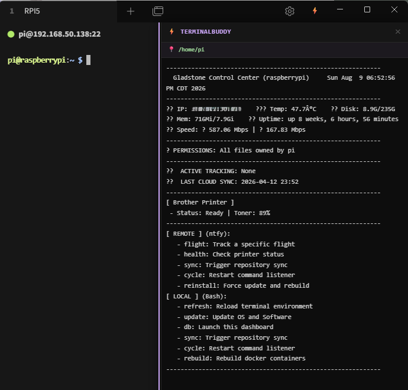
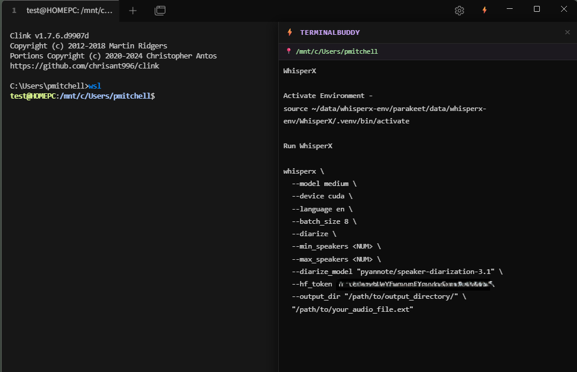
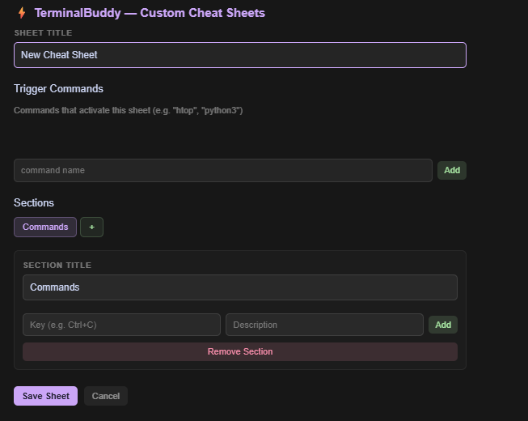
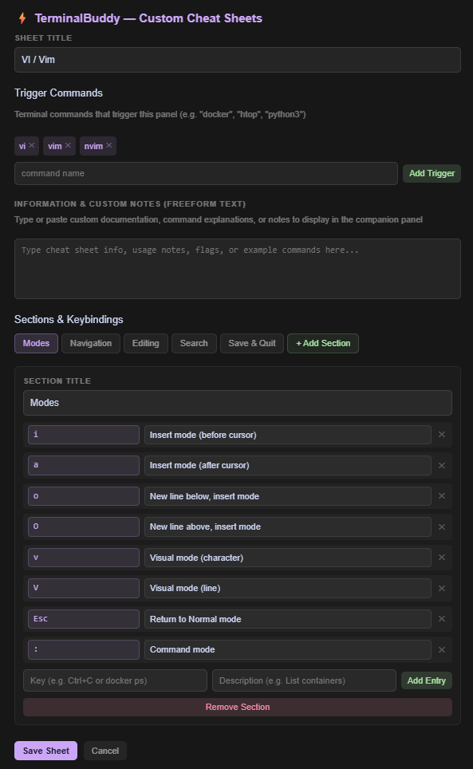

# ⚡ TerminalBuddy

A **Tabby Terminal plugin** that adds a live, context-aware companion panel to your local terminal sessions (PowerShell, CMD) and remote SSH sessions (Linux).

The panel automatically switches between:
- 📋 **Built-in & Custom cheat sheets** — when you enter commands like `vi`, `nano`, `tar`, `find`, `grep`, etc.
- 🖥️ **Your custom dashboard** — when you're at the shell prompt (reads `~/dashboard/dashboard.txt` on Linux or `C:\ProgramData\TerminalBuddy\dashboard.txt` on Windows)
- ➕ **Custom cheat sheets & notes** — add your own for any program or workflow via Settings

---

## Screenshots

| 🖥️ Companion Dashboard | 📋 Context-Aware Cheat Sheet | 📝 Freeform Notes |
|:---:|:---:|:---:|
|  |  |  |

| ⚙️ Settings UI | 🧩 Cheat Sheet Editor | 🔌 Shell Integration Prompt |
|:---:|:---:|:---:|
|  |  |  |

---

## Installation

### Part 1 — Install the Tabby Plugin (Windows)

**From GitHub (manual install):**

1. Download the latest `tabby-terminal-buddy-x.x.x.tgz` from [Releases](https://github.com/pmitchell-dev/TerminalBuddy/releases)
2. Open Tabby → **Settings → Plugins**
3. Click **Install from file** and select the `.tgz`
4. Restart Tabby

**From source (developers):**

```bash
git clone https://github.com/pmitchell-dev/TerminalBuddy.git
cd TerminalBuddy
npm install
npm run build
npm pack
# Then install the resulting .tgz in Tabby as above
```

---

### Part 2 — Install Shell Integration (Linux & Windows)

**For Remote Linux Machines (over SSH):**

Run this **one-liner on each remote Linux machine**:

```bash
curl -sSL https://raw.githubusercontent.com/pmitchell-dev/TerminalBuddy/main/shell-integration/install.sh | bash
```

Then reload your shell (`source ~/.bashrc`).

**For Local Windows Machines (PowerShell):**

Run this **one-liner in PowerShell**:

```powershell
iex (irm https://raw.githubusercontent.com/pmitchell-dev/TerminalBuddy/main/shell-integration/install.ps1)
```

Then reload your PowerShell session (`. $PROFILE`).

---

### Part 3 — Set Up Your Dashboard (Optional)

TerminalBuddy displays your custom `dashboard.txt` file in the companion panel whenever you're at the shell prompt:

- **Linux**: `~/dashboard/dashboard.txt`
- **Windows (Shared for all users)**: `C:\ProgramData\TerminalBuddy\dashboard.txt`

You can use any text — system stats, server info, task status, custom commands, etc.

> **Note:** ANSI color codes in `dashboard.txt` are automatically stripped for clean display.

---

## Custom Cheat Sheets

Add cheat sheets for any terminal program via **Tabby Settings → TerminalBuddy**.

- Set the **trigger command** (e.g. `htop`, `python3`, `docker`)
- Add **sections** with **keybind → description** rows
- Custom sheets override built-ins if the trigger matches

---

## How It Works

TerminalBuddy uses a lightweight shell integration script (Bash/Zsh for Linux, PowerShell & Clink Lua for Windows CMD) that emits custom **OSC escape sequences** into the terminal output stream — the same technique used by iTerm2 Shell Integration and Warp Terminal.

When you run a command, the hook sends: `\e]7701;cmd=vi\a`  
When you return to the prompt, it sends: `\e]7701;prompt;cwd=/home/user;dashboard=<base64>\a`

The Tabby plugin listens for these sequences and updates the panel instantly — no polling, no extra network connections, no ports.

---

## Supported Programs (Built-in Cheat Sheets)

| Program | Triggers |
|---|---|
| VI / Vim | `vi`, `vim`, `nvim` |
| Nano | `nano` |
| Tar | `tar` |
| Find | `find` |
| Grep | `grep`, `egrep`, `fgrep` |
| Systemctl | `systemctl`, `journalctl` |
| Chmod & Chown | `chmod`, `chown` |

---

## Development

```bash
npm install          # Install dependencies
npm run build:dev    # Development build (with source maps)
npm run watch        # Watch mode — auto-rebuilds on file changes
npm run build        # Production build
npm pack             # Package as .tgz for distribution
```

**Tabby plugin directory** (for dev symlink testing):  
`%APPDATA%\tabby\plugins\`

---

## Project Structure

```
terminalbuddy-tabby-plugin/
├── src/
│   ├── index.ts                    # Plugin entry point
│   ├── module.ts                   # Angular module
│   ├── components/                 # UI components
│   │   ├── buddy-panel.*           # Main panel (routes between states)
│   │   ├── cheatsheet.*            # Cheat sheet renderer
│   │   ├── dashboard.*             # Dashboard component
│   │   └── settings.*              # Custom cheat sheet settings UI
│   ├── services/
│   │   ├── context.service.ts      # OSC sequence parser + state
│   │   └── cheatsheet.service.ts   # Cheat sheet resolver
│   ├── providers/                  # Tabby extension point registrations
│   └── data/                       # Default cheat sheet definitions
│       ├── vi.cheatsheet.ts
│       ├── nano.cheatsheet.ts
│       ├── tar.cheatsheet.ts
│       ├── find.cheatsheet.ts
│       ├── grep.cheatsheet.ts
│       ├── systemctl.cheatsheet.ts
│       └── chmod.cheatsheet.ts
└── shell-integration/
    ├── terminalbuddy.sh            # Linux Bash/Zsh hook script
    ├── install.sh                  # Linux one-liner installer
    ├── terminalbuddy.ps1           # Windows PowerShell hook script
    ├── terminalbuddy.lua           # Windows CMD (Clink) hook script
    └── install.ps1                 # Windows one-liner installer
```

---

## License

MIT — see [LICENSE](LICENSE)
